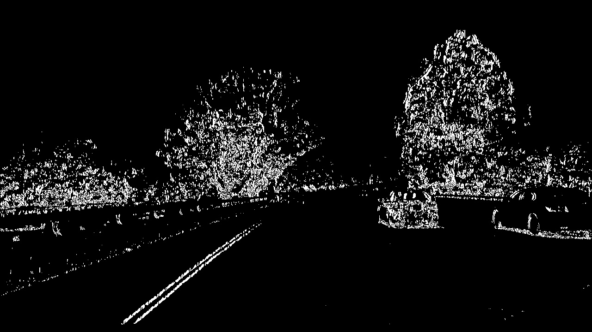
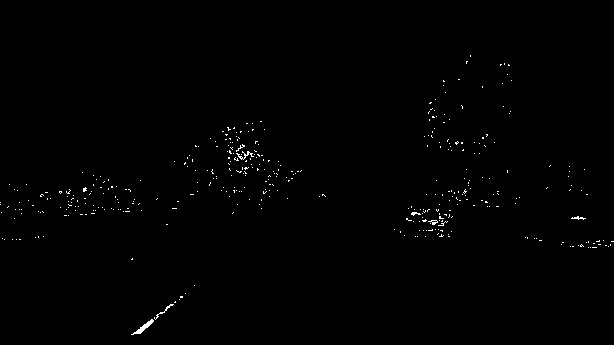
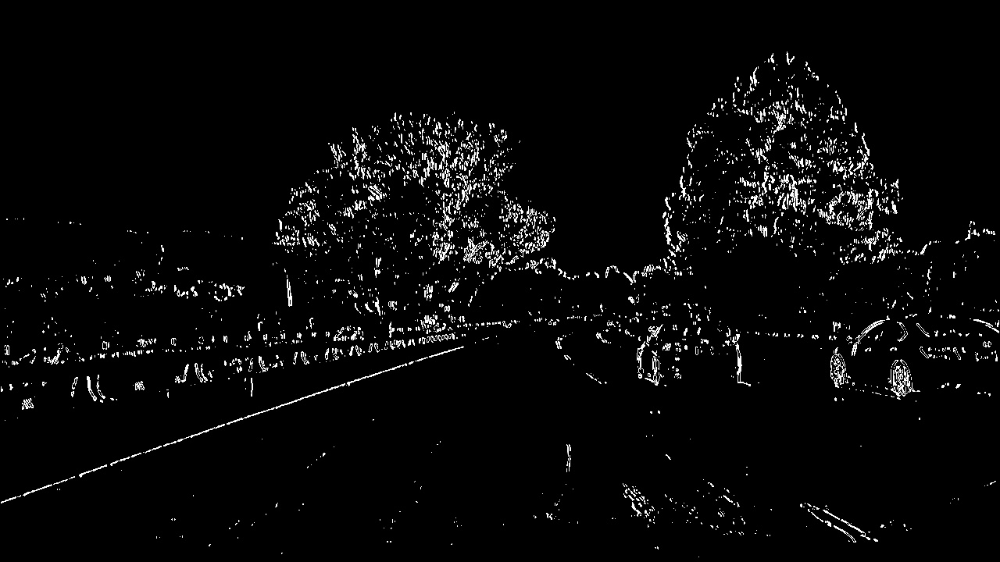
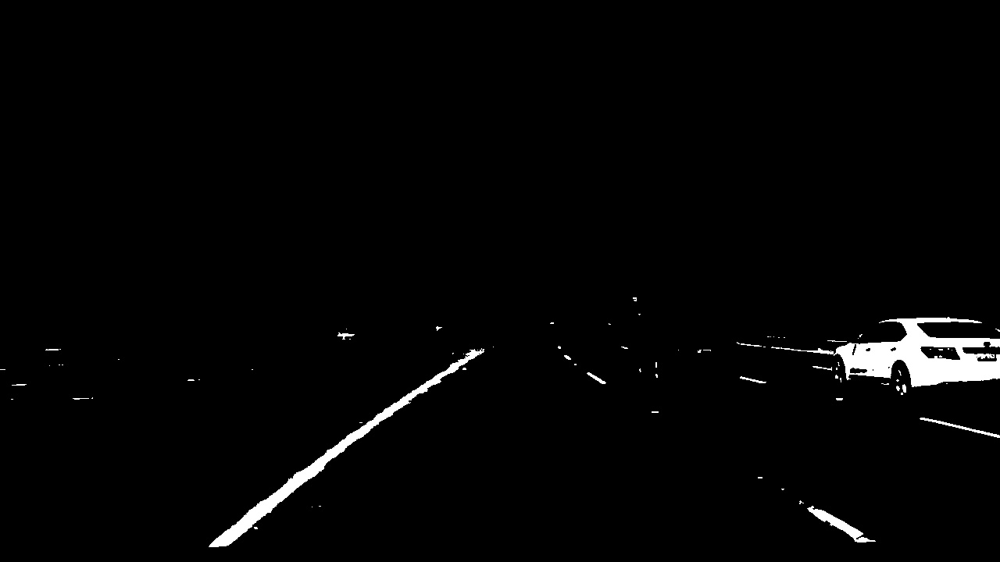
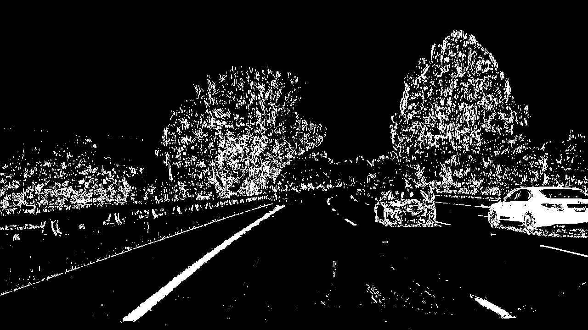
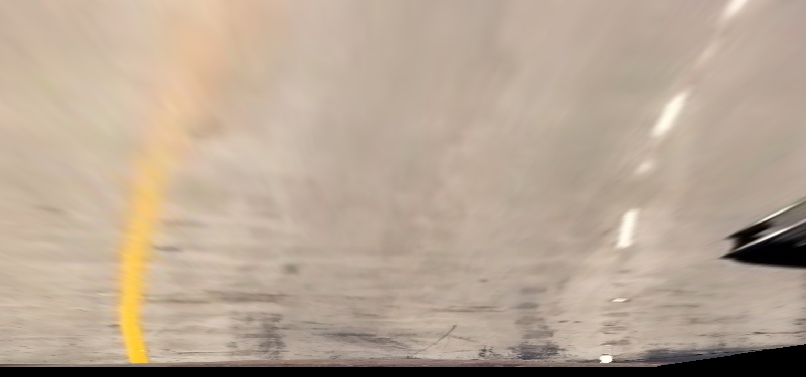
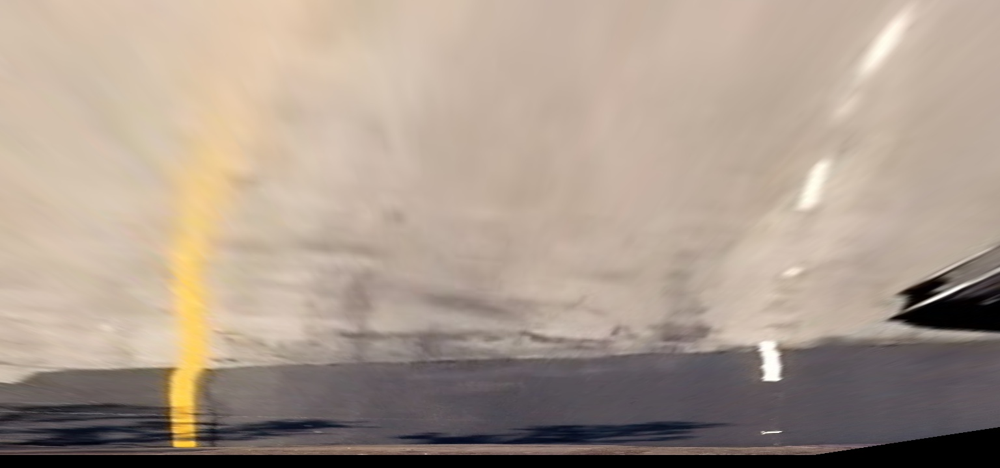
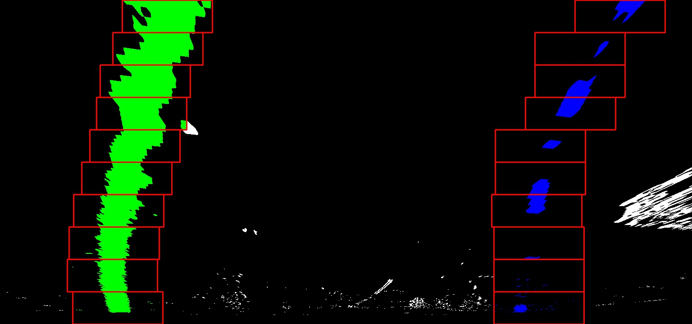
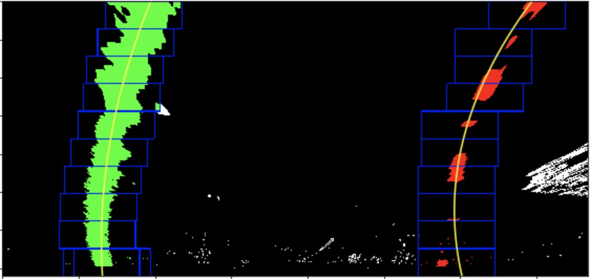
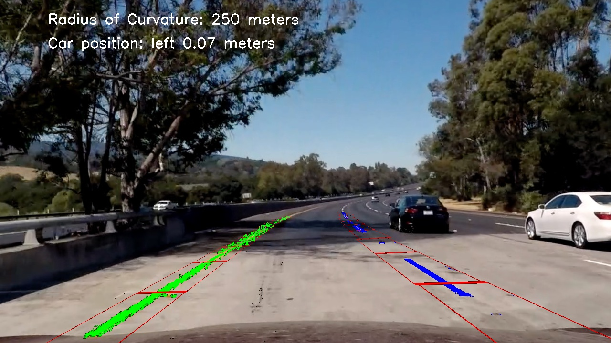

## Writeup for Advanced Lane Finding Project
Author: Bulat Yapparov
---

### Introduction 

[Rubric](https://review.udacity.com/#!/rubrics/571/view) Points for Reference

In this project I have build a pipeline for image/video processing that does the following:
 * Corrects original image for camera distortion
 * Warps the image for bird-eye view perspective
 * Detects traffic lanes
 * Finds curvature of the road 
 * Applies visualisation of results on the original image
 
 
Navigating this repository:
* README file contains writeup for this project.
* lane_lines_research.ipynb is a Jupyter Notebook with research that has been done for this project.
* `Video Processing Pipeline.ipynb` file contains code that was used to generate video output for this project.
* `src` folder contains code that was organised into classes and functions to streamline pipeline.

### 1. Camera Calibration

Camera calibration corrects distortions on the image caused by the camera lens. 

OpenCV provides a group of functions that can be used to for the undistort procedure. 
Method relies on the geometry principles behind the light traveling from the object to camera censor.

OpenCV can estimate transformation performed by the lens by knowing original object positions and corresponding
positions on the image. 

I have used images in the `camera_cal` folder to find `imgpoints` which would correspond to given `objpoints`.
`cv2.calibrateCamera` function from OpenCV library estimates intrinsic camera parameters that can be used on other images
taken by the same camera through the `cv2.undsitort` function. 

Here are two images of the chess board before and after correction:

Original|Undistorted
:--------------:|:---------------:
|

### Pipeline (single images)

#### 1. Undistorted Road Images

Parameters from the previous step can now be applied to the road images to correct for 
lens distortion:

Original|Undistorted
:--------------:|:---------------:
|


#### 2. Binary filter to identify lanes

As conditions of the road and quality of the lanes on the image can differ, I have combined results from several binary 
filters which achieves robust base of my lane detection method. 

First, I have analysed performance of different layers in RGB and HSV colour spaces. 

Red Layer (RGB) and Saturation (HSV) have performed best in representing lines of yellow and white colors. 

I have combined threshold filtering and Sobel gradient filter to achive optimal results for my binary output. 

Binary Mask Name|Image
--------|--------
Saturation Sobel - x|
Saturation threshold|
Red Sobel - x|
Red threshold|
Combined Binary Output|

Code for binary filtering is in the `src/lib.py` and `src/binary_lane_filter.py` files.


#### 3. Warping image to Bird Eye View

To estimate road curvature, we need to transform the image.

To perform this transformation we need a mapping for source point on the original image to the destination pixels on the 
warped image. This mapping is done through definition of 4 points for each image that form a four sided polygon.

I have used several images to calibrate the points in way that produces most consistent result across images by 
producing lines that are parallel.

Here are some of the examples of warping transformation:

Lanes Type|Original Image|Bird Eye View
--------------|--------------|----------------
Straight||
Curved||

In my implementation I have created `ImageWarp` (`src/warp.py`) class with `top_view()` and `car_view` functions which provide 
easy interface to warp images back and forward between the two perspectives that are needed for curvature detection 
and visualisation. 

Source and destination points required for `cv2.getPerspectiveTransform` function from OpenCV library are hard coded
inside the class with the option to pass them as parameters at class initiation.  


#### 4. Identifying lane pixels

To identify lane pixels I have applied sliding windows method. 

Implementation of this method is inside the `TrafficLane` class in `src/line.py` file. 

I have applied smoothing to histograms of the binary mask image that was identified in step 3. This allowed me to 
find initial position of maximums for X axis. 

For pixels within the window I have calculated weighted average of pixel frequency as estimated new center of the 
window. 

Position of the window is only changing if threshold on the maximum frequency is met (smoothed frequency). 

Here is an example of pixels identified in both lanes:




#### 5. Road curvature radius

I have used centers of the windows that were identified in the previous step to fit the curve. I is possible that 
this is not as effective as the method based on the pixels within the windows.

Curvature is calculated in `src/curvature.py` file using estimated coefficients to convert from pixels to meters. 

Based on test images and assuming 3.7m as road width, coefficients are:
 - for X = 3.7/1000 m/px
 - for Y = 30/720 m/px 
 
Here is an example of the fitted polynomial:

Original image|Warped imaged with polynomial line
--------------|----------------------
|

### Pipeline 

#### 1. Image example 

Pipeline function has been build in `src/pipeline.py` file. 



Example of using the code:

```python
import cv2
import matplotlib
import matplotlib.pyplot as plt
from src.pipeline import create_image_processor
process_image = create_image_processor()

img = cv2.imread('test_images/test5.jpg') 
output = process_image(img)
plt.imshow(cv2.cvtColor(output, cv2.COLOR_BGR2RGB))

```

`create_image_processor` is a factory function (closure) that creates a function with attached camera calibration 
object.  This allows the pipeline to do calibration only once for the entire video. 

#### 2. Final output

Here's a [link to my video result](./project_video_output.mp4)

---

### Discussion

#### Limitations of the current approach 

Firstly, pipeline is designed to identify road lines for the car that is positioned close to the middle of the lane and 
directed along the lane. Though this probably covers over 95% of the driving situations on the highway, it is not 
enough for situations where car changes lanes. 
 
To address this, further implementation would need to understand direction of the car as well as it is position, 
to enhance window method. 

Secondly, in the project video car was moving in the empty lane. This is uncommon on some roads near or within larger 
cities. Other cars can be within the lane, or crossing the lane ahead. 

This means we will need a method for car detection to remove them from the image for line detection. 

Lastly, as with the previous project video is taken in very good weather conditions with good day light. 
 
To address this, car positioning can be enhanced through sensors or GPS. It will also going to be required for the cars
to `talk` to each other to share details about each other's speed and position. This would allow cars in congested traffic to 
understand their surroundings much better.
