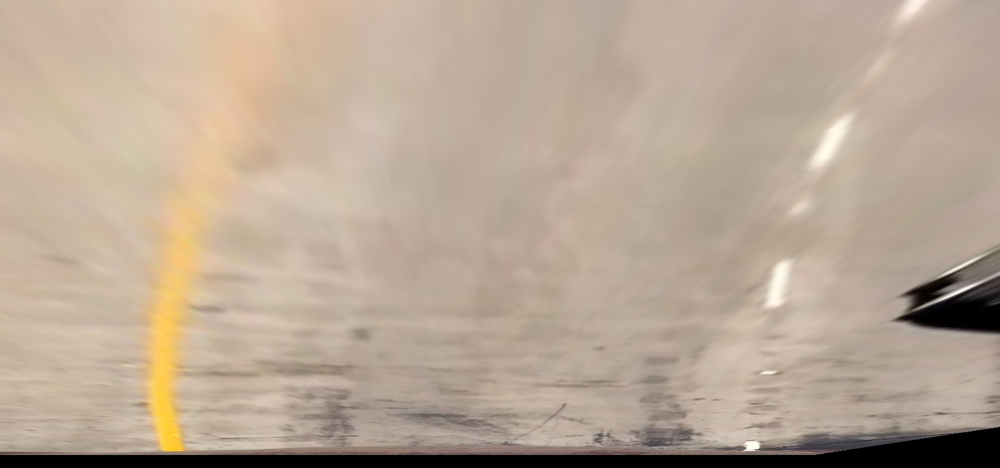
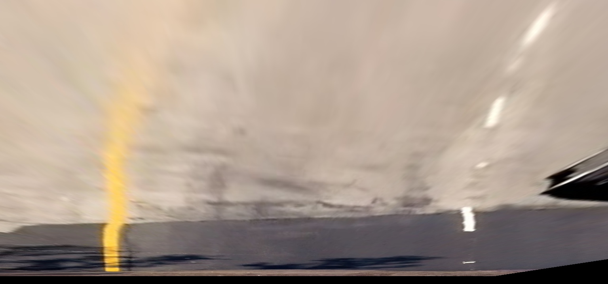

## Writeup for Advanced Lane Finding Project
Author: Bulat Yapparov
---

**Advanced Lane Finding Project**

The goals / steps of this project are the following:

* Compute the camera calibration matrix and distortion coefficients given a set of chessboard images.
* Apply a distortion correction to raw images.
* Use color transforms, gradients, etc., to create a thresholded binary image.
* Apply a perspective transform to rectify binary image ("birds-eye view").
* Detect lane pixels and fit to find the lane boundary.
* Determine the curvature of the lane and vehicle position with respect to center.
* Warp the detected lane boundaries back onto the original image.
* Output visual display of the lane boundaries and numerical estimation of lane curvature and vehicle position.

[//]: # (Image References)

[image1]: ./examples/undistort_output.png "Undistorted"
[image2]: ./test_images/test1.jpg "Road Transformed"
[image3]: ./examples/binary_combo_example.jpg "Binary Example"
[image4]: ./examples/warped_straight_lines.jpg "Warp Example"
[image5]: ./examples/color_fit_lines.jpg "Fit Visual"
[image6]: ./examples/example_output.jpg "Output"
[video1]: ./project_video.mp4 "Video"

## [Rubric](https://review.udacity.com/#!/rubrics/571/view) Points

### Introduction 

In this project I have build a pipeline for image/video processing that does the following:
 * Corrects original image for camera distortion
 * Warps the image for bird-eye view perspective
 * Detects traffic lanes
 * Finds curvature of the road 
 * Applies visualisation of results on the original image
 

### 1. Camera Calibration

Camera calibration corrects distortions on the image caused by the camera lens. 

OpenCV provides a group of functions that can be used to for the undistort procedure. 
Method relies on the geometry principles behind the light traveling from the object to camera censor.

OpenCV can estimate transformation performed by the lens by knowing original object positions and corresponding
positions on the image. 

I have used images in the `camera_cal` folder to find `imgpoints` which would correspond to given `objpoints`.
`cv2.calibrateCamera` function from OpenCV library estimates intrinsic camera parameters that can be used on other images
taken by the same camera through the `cv2.undsitort` function. 

Here are two images of the chess board before and after correction:

Original|Undistorted
:--------------:|:---------------:
|

### Pipeline (single images)

#### 2. Undistorted Road Images

Parameters from the previous step can now be applied to the road images to correct for 
lens distortion:

Original|Undistorted
:--------------:|:---------------:
|

#### 2. Binary filter to identify lanes

As conditions of the road and quality of the lanes on the image can differ, I have combined results from several binary 
filters which achieves robust base of my lane detection method. 

First, I have analysed performance of different layers in RGB and HSV colour spaces. 

Red Layer (RGB) and Saturation (HSV) have performed best in representing lines of yellow and white colors. 

I have combined threshold filtering and Sobel gradient filter to achive optimal results for my binary output. 

Binary Mask Name|Image
--------|--------
Saturation Sobel - x|
Saturation threshold|
Red Sobel - x|
Red threshold|
Combined Binary Output|

#### 3. Warping image to Bird Eye View

To estimate road curvature, we need to transform the image.

To perform this transformation we need a mapping for source point on the original image to the destination pixels on the 
warped image. This mapping is done through definition of 4 points for each image that form a four sided polygon.

I have used several images to calibrate the points in way that produces most consistent result across images by 
producing lines that are parallel.

Here are some of the examples of warping transformation:

Lanes Type|Original Image|Bird Eye View
--------------|--------------|----------------
Straight||
Curved||

In my implementation I have created `ImageWarp` (`src/warp.py`) class with `top_view()` and `car_view` functions which provide 
easy interface to warp images back and forward between the two perspectives that are needed for curvature detection 
and visualisation. 

Source and destination points required for `cv2.getPerspectiveTransform` function from OpenCV library are hard coded
inside the class with the option to pass them as parameters at class initiation.  

#### 4. Identifying lane pixels

#### 5. Describe how (and identify where in your code) you calculated the radius of curvature of the lane and the position of the vehicle with respect to center.

I did this in lines # through # in my code in `my_other_file.py`

#### 6. Provide an example image of your result plotted back down onto the road such that the lane area is identified clearly.

I implemented this step in lines # through # in my code in `yet_another_file.py` in the function `map_lane()`.  Here is an example of my result on a test image:

![alt text][image6]

---

### Pipeline (video)

#### 1. Provide a link to your final video output.  Your pipeline should perform reasonably well on the entire project video (wobbly lines are ok but no catastrophic failures that would cause the car to drive off the road!).

Here's a [link to my video result](./project_video.mp4)

---

### Discussion

#### 1. Briefly discuss any problems / issues you faced in your implementation of this project.  Where will your pipeline likely fail?  What could you do to make it more robust?

Here I'll talk about the approach I took, what techniques I used, what worked and why, where the pipeline might fail and how I might improve it if I were going to pursue this project further.  
